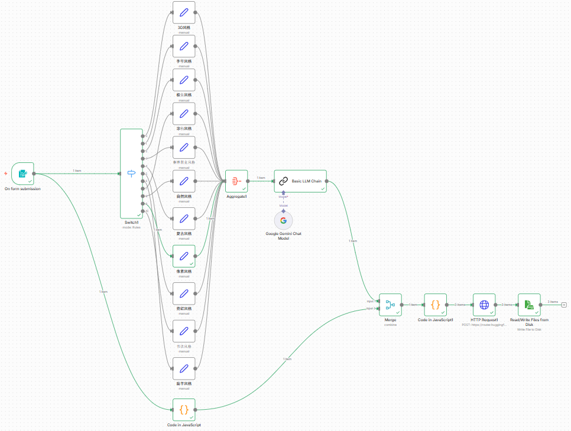
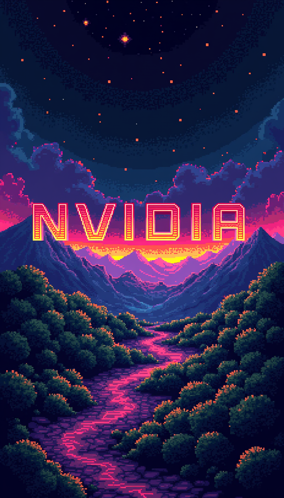
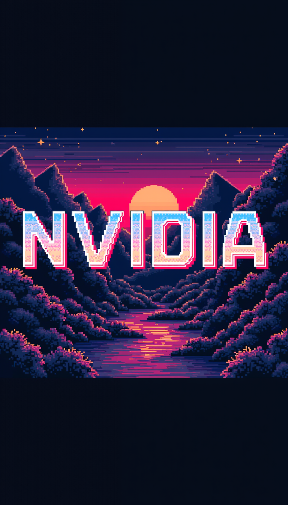

# AIOT_hw5

# 🎨 AI Commercial Poster Generator (n8n Workflow) - 全自動商業海報生成器

這是一個基於 **n8n** 的自動化工作流專案。本專案修改並重構了原本僅能生成靜態圖片的基礎流程，整合了 **Google Gemini (LLM)** 的語意理解能力與 **Hugging Face FLUX.1-dev** 的強大繪圖能力，打造出一個**零成本、高品質、支援文字渲染且可批次生成**的商業海報生成系統。

> **專案起源**：本專案仿照並致敬 [AI学长小林](https://www.youtube.com/watch?v=aXocGiEx-qc) 的 n8n 自動化思路，基於其 [n8nposter.json](https://github.com/soluckysummer/n8n_workflows/blob/main/workflows/n8nposter.json) 進行深度客製化與功能增強。

---

## 📸 成果展示 (Demo)

### ⚙️ 系統介面 (System Interface)

**1. n8n 工作流全覽**

**2. 使用者操作表單** (支援風格選擇、尺寸切換與批次數量)

---

### 🖼️ 批次生成實測 (Batch Generation Results)
以下為設定 **「數量: 3」** 時，系統一次自動生成的 3 張連號圖片 (p1, p2, p3)，每張圖均帶有獨立的隨機種子碼 (Seed)。

| 生成結果 P1 | 生成結果 P2 | 生成結果 P3 |
| :---: | :---: | :---: |
|  |  |  |

---

## ✨ 核心功能 (Features)

與原版工作流相比，本專案進行了以下重大升級：

1.  **零成本方案 (Cost-Efficiency)**：
    * 移除原版昂貴的 OpenAI DALL-E 3。
    * 全面改用 **Google Gemini 1.5 Flash** (免費額度) 進行提示詞優化。
    * 改用 **Hugging Face Inference API** 調用 **FLUX.1-dev** 模型 (目前開源界最強文字渲染模型)。

2.  **文字渲染支援 (Text Rendering)**：
    * 解決了傳統 AI 繪圖無法正確寫字的問題。透過 System Prompt 工程，讓 Gemini 將中文標題轉譯為 FLUX 可識別的 `text "..."` 指令，實現在海報上精準呈現英文標題。

3.  **智能尺寸控制 (Dynamic Aspect Ratio)**：
    * 不侷限於正方形。使用者可透過選單選擇：
        * `直式海報 (9:16)`：適合 IG Reels / TikTok。
        * `正方形 (1:1)`：適合社群貼文。
        * `橫式看板 (16:9)`：適合 YouTube 封面。
        * `傳統海報 (3:4)`。
    * 後端透過 JavaScript 自動映射對應的像素 (如 768x1344)。

4.  **批次生成機制 (Batch Processing)**：
    * 支援一次生成 **1~3 張** 圖片。
    * 利用 Code 節點實作「分身機制」，為每一張圖注入獨立的 **隨機 Seed**，確保產出的多樣性。
  
## 🛠️ 技術挑戰與解決方案 (Challenges & Solutions)

在開發過程中，遇到並解決了以下關鍵技術問題：

### 1. API 串接與路由問題
* **問題**：Hugging Face 的 API 端點近期進行了改版，原本的 `api-inference.huggingface.co` 會回傳 404 或重定向錯誤。
* **解決**：查閱文檔後，將 Endpoint 更新為最新的 `https://router.huggingface.co/hf-inference/...`，並手動配置 HTTP Header (`Authorization: Bearer <Token>` 與 `Accept: image/png`)，成功打通 API。

### 2. JSON 格式崩潰 (Escaping Issue)
* **問題**：當 LLM 生成的 Prompt 包含雙引號 (例如 `text "SALE"`) 時，直接放入 JSON 會導致格式錯誤 (Invalid JSON)。
* **解決**：在 HTTP Request 的 Body 中使用 `JSON.stringify($json.text)` 函數，自動處理跳脫字元，確保 JSON 結構穩定。

### 3. 資料流合併 (Merge Strategy)
* **問題**：左路 (尺寸參數) 與 右路 (Prompt) 是兩筆獨立的資料，預設的 Merge 會將其變成兩筆獨立的 Items，導致後續節點讀取失敗（變數為 undefined）。
* **解決**：將 Merge 節點設定為 **`Combine`** 模式，並使用 **`Merge By Position`**，將參數與 Prompt 強制合併為同一個 JSON 物件。

### 4. 批次生成 (Batch Loop)
* **問題**：HTTP Request 節點預設只執行一次，無法根據表單選擇的數量生成多張圖。
* **解決**：撰寫 JavaScript Code 節點，讀取 `batch_size` 參數，利用迴圈 `for loop` 複製資料，並為每一筆資料生成 `Math.random()` 的 Seed，觸發 n8n 的自動迴圈機制。

---

## 🔮 未來改進方向 (Future Improvements)

* **圖像反推 (Image-to-Image)**：增加上傳參考圖的功能，讓使用者可以指定構圖。
* **負向提示詞 (Negative Prompt)**：在表單增加「不想看到的元素」欄位，精準控制生成結果。

致謝 (Credits) 本專案靈感與基礎架構參考自 GitHub: soluckysummer/n8n_workflows
